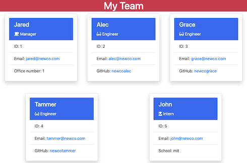

# Team Profile Generator README 

  

  

## Table of Contents 

* [Description](#description)
* [Installation](#installation)
* [Usage](#usage)
* [License](#license)
* [Contributions](#contributions)
* [Test](#tests)
* [Questions](#questions)

## Description 
Team Profile Generator v1

Team Profile Generator was created for the purpose of generating an HTML webpage to display information about employees on a software engineering team.

Link: https://github.com/wendyqnguyen/team-profile-generator

## Installation 

1) Install npm: https://www.npmjs.com/. 
2) Install Node JS via nmp: https://nodejs.org/en/download/package-manager/. 
3) Install the following npm packages: fs, inquirer, jest

## Usage 

Enter app command "node index.js" and follow prompt. once all team information has been entered, a file called "team.html" will be created in the 'dist' directory.

Demo video: 

## License 
    None

## Contributions 

Developers: https://github.com/wendyqnguyen/

## Tests 

This project includes 4 test: Employee, Engineer, Intern and Manager
Once all required packages are installed, tests can be run using the following command: npm test

## Questions 

For general inquiry regarding Team Profile Generator, please contact us via the following channels: 

- wendyqnguyen - [@github](https://github.com/wendyqnguyen/)

